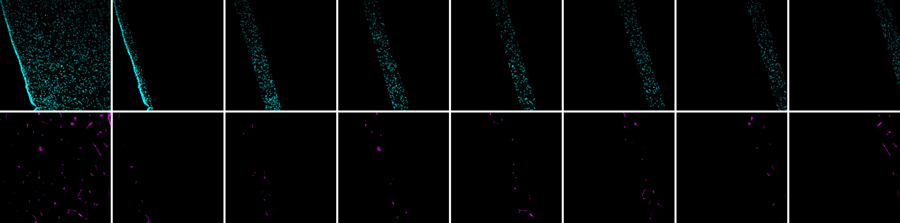

== Presentation

The aim is to create a stack by acquisition with the initial images and one image per strip and per channel. 

image::images/Montage03.png[]

== Requirements

Create a folder with the acquisitions to process. 

== How to use the "stripscan" macro

* Open macro with ImageJ: File -> Open.... A "stripscan.ijm" window open. 
* If the language is not found, choose another one in the "stripscan.ijm" window: language [red]#(1)# -> IJ1 Macro  [red]#(2)#
* Run macro: click on the "Run" button. [red]#(3)#

image::images\winmacro.png[]

* Select the folder with the acquisitions and click on "Select" button. 
* A "Line Width" dialog box open. Choose the value for the thickness of the strip in pixels. For exemple, 300 pixels here,  and click on "OK" button. 

image::images\boxWidth.png[]

* The first image and an "Action Required" dialogue box open. 
* Draw segmented line following biological border by clicking on the image. Right-click to end the line. When you finish, click on "OK" button in the dialogue box. Do this step for all the images in the folder. 

image::images\draw_01_10cm.png[]

* A "result" folder is created. For each acquisition: 
** a stack is saved. It contains the initial images and one image per strip and per channel.
** a zip folder is saved with ROIs corresponding to the strips. You can open these ROIs with the tool "ROI Manager" of FIJI. 

* The files names are the same as the acquisition names. 

* The "done" folder contains the analysed images.  

